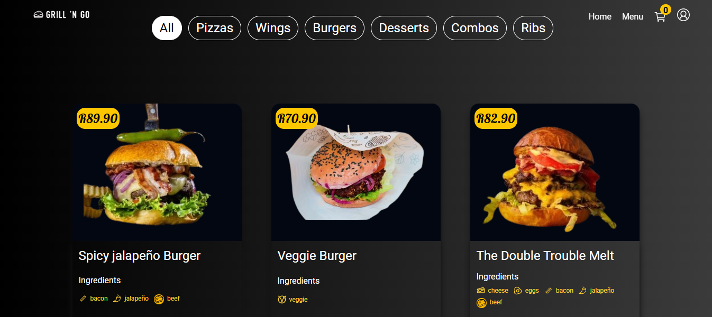
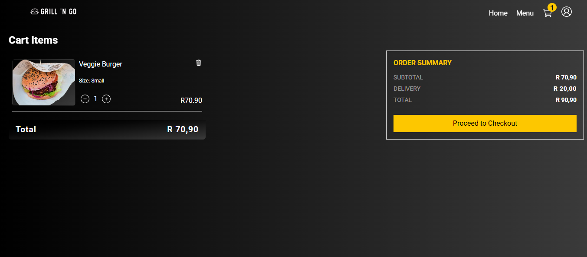
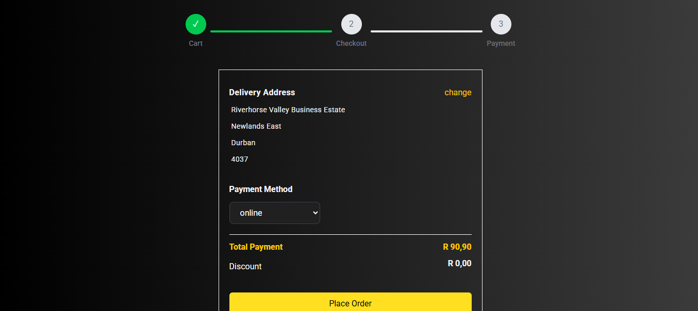
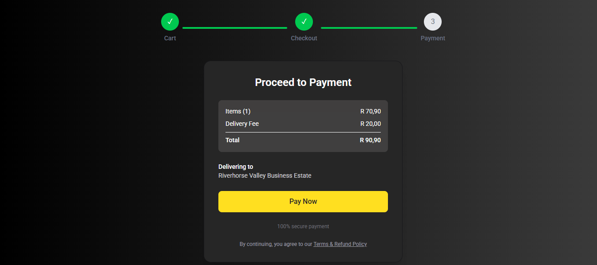
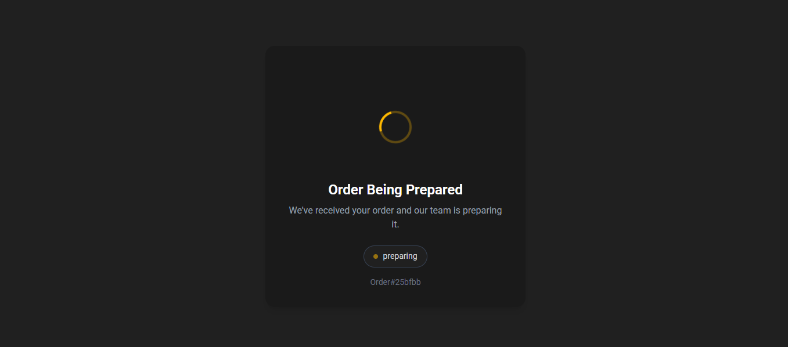
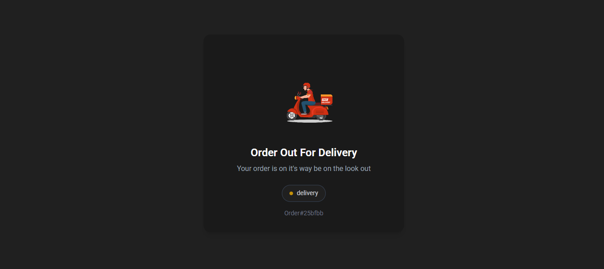
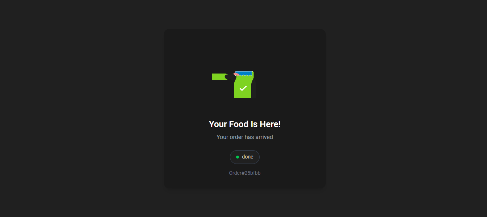
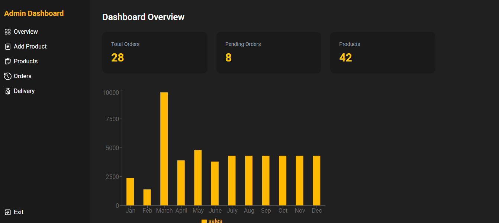

[](https://www.typescriptlang.org/)
[](https://react.dev/)
[](https://zod.dev/)
[](https://vitejs.dev/)
[](https://tailwindcss.com/)
[](https://reactrouter.com/)
[](https://tanstack.com/query/latest)
[](https://resend.com/)
[](https://nodejs.org/)
[](https://expressjs.com/)
[](https://supabase.com/)
[](https://www.postgresql.org/)


# Food Delivery

A full-stack food delivery platform with real-time order tracking, secure authentication, and integrated payments — built as a single-page application with a layered backend architecture.

**🔗 Live Demo:** [https://food-delivery-ydng-peach.vercel.app](https://food-delivery-ydng-peach.vercel.app)

<br />

## Screenshots
      


<br />

## Tech Stack

### Frontend
- **React** (Vite) — fast dev server and build tooling
- **TypeScript**
- **Tailwind CSS** — utility-first styling
- **TanStack Query** — server-state management, caching, and data fetching
- **Zod** — runtime schema validation and type inference
- **React Router** — client-side routing (SPA)

### Backend
- **Node.js** with **TypeScript**
- **Express** — REST API framework
- **Layered architecture** (routes → controllers → services → data access)
- **Centralized error handling** — consistent error responses across the API
- **Logging** — structured request/error logging
- **Rate limiting** — applied to authentication endpoints to mitigate brute-force attacks

### Database & Realtime
- **Supabase** (PostgreSQL)
- **Supabase Realtime** — live order status updates pushed to clients

### Payments
- **PayFast** — payment gateway integration for order checkout

<br />

## Features

-  **Authentication** — secure login with HTTP-only cookies, access & refresh token rotation
-  password reset
-  optimistic updates
-  **Rate-limited login** — protects against brute-force login attempts
-  **Order creation & delivery** — full order lifecycle from cart to delivery
-  **Real-time order tracking** — live status updates via Supabase Realtime
-  **Order history** — users can view past orders
-  **Admin dashboard** — manage orders, users, and platform data
-  **PayFast payment integration** — secure checkout flow
-  **Single Page Application (SPA)** — smooth client-side navigation
-  responsive layout
-  **Layered backend architecture** — clear separation of concerns for maintainability
-  **Centralized error handling** — uniform error responses and logging
-  **Logging** — tracks requests and errors for observability

<br />

## Getting Started

### Prerequisites
- Node.js (LTS recommended)
- A Supabase project (URL + API keys)
- PayFast merchant credentials (sandbox)

### 1. Clone the repository
```bash
git clone <repo-url>
cd food-delivery
```

### 2. Install dependencies
```bash
# Frontend
cd frontend
npm install

# Backend
cd backend
npm install
```

### 3. Environment variables

**Backend (`backend/.env`)**
```env
PORT=
SUPABASE_DB_URL=
ACCESS_TOKEN_SECRET=
REFRESH_TOKEN_SECRET=
ACCESS_TOKEN_EXPIRY=
REFRESH_TOKEN_EXPIRY=
PAYFAST_MERCHATN_ID=
PAYFAST_MERCHATN_KEY=
PAYFAST_PASSPHRASE=
LOGIN_RATE_LIMIT_WINDOW_MS=
LOGIN_RATE_LIMIT_MAX=
```

<br />

**Frontend (`frontend/.env.local`)**
```env
VITE_PAYFAST_MERCHATN_ID=
VITE_PAYFAST_MERCHATN_KEY=
VITE_SUPABASE_PUBLISHABLE_KEY=
VITE_SUPABASE_URL=
VITE_BACKEND_URL=

```

### 4. Run the app locally

```bash
# Backend
cd backend
npm run dev

# Frontend (in a separate terminal)
cd frontend
npm run dev
```

The frontend will run on `http://localhost:5173` and the backend on `http://localhost:3000` by default.

---

## Security Notes

- Refresh tokens are stored in **HTTP-only, secure cookies** — never exposed to client-side JavaScript.
- Access tokens are short-lived and refreshed silently in the background.
- Login endpoints are rate-limited to reduce brute-force risk.
- All input is validated with **Zod** on the client and server.


<br />

## Scripts

| Command | Location | Description |
|---|---|---|
| `npm run dev` | frontend/backend | Start development server |
| `npm run build` | frontend | Build for production |

